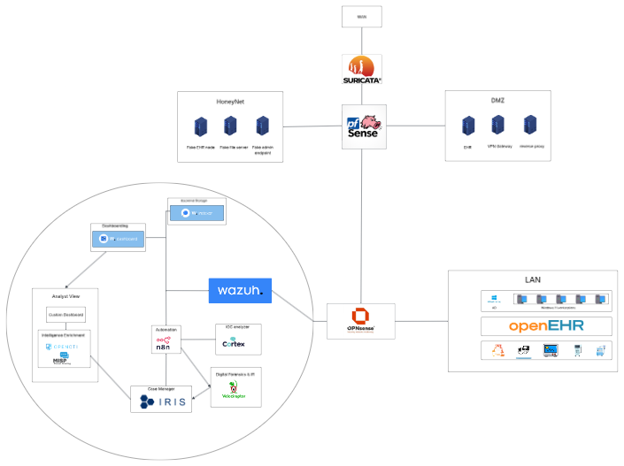

# Architecture Design Decisions

## Project: Healthcare SOC Home Lab
**Status:** In progress  
**Last updated:** May 2026

---

## Overview

This document explains the reasoning behind every architectural decision made in this project. The goal is not just to build a working lab, but to understand *why* each component is placed where it is — mirroring the reasoning a security engineer would apply in a real healthcare environment.

---

## 1. Why a dual-firewall design?

The architecture uses two separate firewalls in series — PFSense at the edge and OPNSense internally — rather than a single firewall.

**Reasoning:**
- Defense-in-depth: if the edge firewall is compromised or misconfigured, the internal firewall provides a second enforcement point
- Vendor diversity: using different vendors at each layer means a zero-day or critical vulnerability in one product does not expose the entire network
- Separation of concerns: the edge firewall handles north-south perimeter filtering, while the internal firewall focuses on east-west segmentation and internal threat detection
- In healthcare environments, segmentation between the DMZ (public-facing services) and internal clinical systems (LAN) is a HIPAA technical safeguard requirement

---

## 2. Why PFSense + Snort at the edge?

PFSense was chosen as the edge firewall with Snort integrated as the IDS/IPS engine.

**Reasoning:**
- Snort has more mature and actively maintained ruleset support for perimeter threats, particularly the Talos Intelligence ruleset from Cisco, which is well-suited for north-south traffic inspection
- PFSense has strong community support, extensive documentation, and is widely deployed in enterprise environments — making it a relevant skill to develop
- Snort's inline IPS mode at the perimeter allows blocking of known malicious traffic before it reaches the internal network

---

## 3. Why OPNSense + Suricata at the internal layer?

OPNSense was chosen as the internal firewall with Suricata as the IDS/IPS and primary NDR engine.

**Reasoning:**
- Suricata is multi-threaded and handles east-west traffic inspection more efficiently than Snort in high-throughput internal environments
- Suricata's protocol analysis capabilities (HTTP, DNS, TLS, SMB, HL7) are more relevant for detecting lateral movement and internal threats in a healthcare network
- OPNSense has a cleaner plugin architecture for Suricata integration and more granular VLAN/interface management, making it better suited for internal segmentation
- Using a different vendor and IDS engine at the internal layer adds another layer of vendor diversity

---

## 4. Why is the primary NDR positioned east-west, not north-south?

This was a deliberate and considered decision based on how real healthcare breaches actually unfold.

**Reasoning:**
- The majority of significant healthcare breaches — ransomware, insider threats, EHR data exfiltration — occur *after* initial access, during the lateral movement phase inside the network
- A perimeter-only NDR will detect the front door being opened but miss everything that happens inside
- HIPAA and HITECH audit requirements focus heavily on detecting unauthorized access to PHI, which almost always involves internal movement after initial compromise
- MITRE ATT&CK for healthcare threat actors shows that post-compromise techniques (lateral movement, credential dumping, data staging) are where detection opportunities are highest
- The internal firewall sees all traffic crossing between VLANs, making OPNSense+Suricata at this position the highest-value detection point in the architecture

---

## 5. Why is there a passive Suricata NDR before the edge firewall?

A separate Suricata instance operates in passive mode on the WAN-side network segment, before PFSense.

**Reasoning:**
- This position provides visibility into raw, unfiltered internet traffic — reconnaissance scans, blocked exploit attempts, and attack patterns that PFSense+Snort would silently drop
- This threat landscape data is valuable for the SOC to understand what adversaries are targeting, even when the edge firewall successfully blocks them
- It is deliberately passive (not inline) — making it inline at this position would create a bottleneck and single point of failure before the edge firewall, which is unacceptable
- In VMware, this is implemented as a dedicated Suricata VM connected to the WAN vSwitch in promiscuous mode, mirroring all traffic without being in the forwarding path
- Both NDR sensors (passive WAN and inline internal) ship alerts to the SIEM, giving the SOC full kill-chain visibility

---

## 6. Why include a HoneyNet?

A HoneyNet of decoy systems is connected at the edge layer.

**Reasoning:**
- Honeypots in healthcare environments are an effective low-noise detection mechanism — any connection to a decoy system is inherently suspicious and warrants investigation
- They provide early warning of lateral movement: an attacker who has breached the perimeter and is conducting internal reconnaissance will eventually probe the honeypot
- They generate high-fidelity alerts with very low false positive rates, reducing analyst fatigue
- In a lab context, they also serve as safe targets for simulating attacker behavior without risking actual systems

---

## 7. Why is a SIEM the central collection point?

All log sources — both NDR sensors, both firewalls, the HoneyNet, and endpoint agents on LAN hosts — ship to a central SIEM before reaching the SOC.

**Reasoning:**
- Individual tools (Snort, Suricata, firewall logs) produce alerts in isolation — a SIEM correlates events across sources to identify multi-stage attacks that no single tool would detect alone
- A SIEM provides the timeline reconstruction capability needed for incident response — understanding the full sequence of attacker actions requires correlating logs across all layers
- For healthcare compliance, a SIEM provides the audit logging and reporting capabilities required by HIPAA Security Rule §164.312(b)
- Wazuh is the primary candidate for this lab: it is open source, has native HIPAA compliance dashboards, supports Suricata and Snort log ingestion via Filebeat, and provides endpoint agent deployment for LAN hosts

---

## Current architecture diagram

*Diagram will be updated as the lab progresses through each build phase.*

---

## Open questions / future decisions

- [ ] Finalize services to deploy in the DMZ (EHR portal simulation, VPN gateway)
- [ ] Define LAN segments and endpoint agent deployment strategy
- [ ] Select specific Suricata rulesets for healthcare protocol coverage (HL7, FHIR)
- [ ] Define SOC playbooks for key detection scenarios
- [ ] Evaluate whether to add a dedicated threat intel feed (MISP, OpenCTI)
